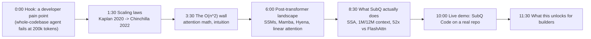

## Status (snapshot)

**Last updated:** 2026-05-09. Lean micromamba env works (`make setup`, `make check`). Teaser smoke-render at `QUALITY=-ql` passes all 6 scenes. Deep-dive `make deepdive` requires system LaTeX with `preview` package for `MathTex`/`equation()` — see README troubleshooting.

What's done:
- Handoff docs: AGENTS.md, DESIGN.md, TASKS.md
- Lean Makefile `setup` (manim + ffmpeg only); `set -e` on render loops
- Teaser scene 2: `Text("O(n²)")` instead of MathTex (portable without LaTeX preview package)

What's next:
- Install LaTeX `preview` (or refactor deep-dive equations to Text)
- Polish teaser → render `-qh`, VO + edit
- Deep-dive renders + shoot day

See [AGENTS.md](../AGENTS.md) for full handoff context (decisions, gotchas, file map), [DESIGN.md](../DESIGN.md) for visual + narrative principles, and [TASKS.md](../TASKS.md) for the live actionable backlog.

---

## Why this works for the application

The JD is unusually specific: end-to-end video, on-camera presence, technical depth on LLMs, ability to ship reference repos and written content **independently**. A single submission that hits all five — teaser + deep-dive + GitHub starter + blog post + X thread — is a working DevRel portfolio, not a job application. SubQ launched May 5, 2026 ($29M seed, 12M-token SSA, viral on X, 30k waitlist signups). Riding the launch wave with high-quality educational content within ~2 weeks is the single best signal Tina can send.

## The two deliverables

**1. Teaser (60-90s, pure Manim + VO)** — one visual idea: the quadratic curve eating compute, then snapping to linear. Optimized for X / LinkedIn / Discord. Ends on "full deep-dive linked below."

**2. Deep-dive (~10-12 min, hybrid)** — expert-level 3B1B-style explainer with Tina on-camera intro/outro + Manim core + a live SubQ Code demo (loading a whole codebase into context) at the end. This is the centerpiece of the application.

## Narrative arc (deep-dive)

The teaser is essentially the Wall + SubQ beats compressed to 75 seconds.

## Phase 1 — Research (Days 1-2)

Tina needs to be unmistakably fluent on three bodies of work. Source list to actually read, not skim:

- **Scaling laws**
  - Kaplan et al. 2020, *Scaling Laws for Neural Language Models*
  - Hoffmann et al. 2022 (Chinchilla), *Training Compute-Optimal Large Language Models*
  - Hernandez et al. on data scaling; Anthropic's *Scaling Monosemanticity* for context
  - Key intuitions to internalize: power-law loss curves, compute-optimal N/D ratio (~20 tokens/param), why "bigger model" ≠ "better model" without matched data

- **The quadratic bottleneck**
  - Vaswani et al. 2017, *Attention Is All You Need* — derive O(n²·d) yourself
  - FlashAttention 1/2/3 (Dao et al.) — IO-aware attention, the strongest counterargument to "attention is unfixable"
  - KV cache memory math at long context (this is the visceral pain point)

- **Subquadratic landscape**
  - Mamba (Gu & Dao 2023), Mamba-2
  - Hyena (Poli et al. 2023) — long convolutions + data-controlled gating
  - RWKV, RetNet, Linear Attention (Katharopoulos), Performer, Linformer
  - Hybrid: SAMBA (Mamba + sliding window), Jamba
  - MOHAWK distillation

- **SubQ-specific** (company)
  - subq.ai/introducing-subq launch post
  - SiliconANGLE coverage (May 5, 2026): $29M seed, $500M valuation
  - Founders: Justin Dangel (CEO), Alexander Whedon (CTO, ex-Head of GenAI at Meta)
  - Architecture: Subquadratic Sparse Attention (SSA), linear scaling, 12M context (research), 1M (prod), 52x faster than FlashAttention at 1M tokens, 1000x attention compute reduction at 12M, 95% RULER 128K
  - Products: SubQ API, SubQ Code (CLI codebase agent), SubQ Search
  - VentureBeat caveat: "researchers demand independent proof" — Tina should know this exists; the video shouldn't oversell, it should *teach the math* so viewers can evaluate the claims themselves. That credibility move alone differentiates her from typical DevRel hype videos.

Output of this phase: a single `research/notes.md` with the equations, citations, and 5-10 "killer intuitions" that will become Manim scenes.

## Phase 2 — Scripting (Day 3)

Two scripts, written to time:

- `scripts/teaser.md` — ~150 words, single take, every word earns its keep
- `scripts/deepdive.md` — ~1600-1800 words at ~150 wpm, with `[ANIM: ...]` and `[ON-CAM]` and `[SCREEN]` markers inline

Hard rules borrowed from 3B1B:
- One idea per scene, animated transitions carry the logic
- Never read an equation aloud without the visual already on screen
- Earn every claim — if the video says "52x faster," the next frame shows the benchmark source

Open mic feedback loop: record a scratch VO of the deep-dive script the same day, listen at 1x and 1.5x, cut anything that drags.

## Phase 3 — Production tooling (Day 3, parallel)

Repo structure to set up:

- `vid/` — Manim Community Edition. **Named `vid/`, not `manim/`**, to avoid the `manim` PyPI namespace collision (see [AGENTS.md](../AGENTS.md) decision 2).
  - `scenes/teaser/` and `scenes/deepdive/` with one file per scene
  - Shared `theme.py` with 3B1B-ish palette + a custom `SubQWordmark` mobject
- `audio/` — Final VO (record in a closet with blankets if no booth; a Shure MV7 or even AirPods Pro with Krisp is acceptable)
- `video/` — On-camera footage (single key light + window fill, 4K 24fps, lavalier mic)
- `edit/` — DaVinci Resolve project (free tier is fine; better color than Premiere)
- `demo/` — Live SubQ Code screen capture (OBS, 1440p, hide secrets)
- `companion/` — Blog post (MDX) + GitHub starter repo `subq-quickstart`
- `Makefile` with `make teaser`, `make deepdive`, `make all`, `make stills`

Manim version note: Manim CE 0.20+ from conda-forge. `manim-voiceover` is **deferred** (heavy TTS deps make the conda solve hang); install with pip on demand if VO automation becomes useful. Don't use 3b1b/manim — it's the personal version, harder to install, fewer maintainers.

## Phase 4 — Animation (Days 4-7)

**Teaser scenes (~6 scenes, ~75s)**

1. Open on a flat O(n) line, label it "what scales"
2. Curve up to O(n²) — color it red, watch it eat the frame
3. Overlay GPU memory bar filling up at 200k, 500k, 1M tokens
4. Crack the curve — replace with linear scaling, color green
5. SubQ logo + "1M tokens. 52x faster. Linear scaling."
6. CTA: "Full breakdown ↓"

**Deep-dive scenes (~14 scenes)**

1. Cold open: terminal trying to load a 400k-token codebase, OOM error, cut
2. On-cam: "Hi, I'm Tina. Today: why every frontier lab is quietly betting against the transformer."
3. Scaling laws — animate the Kaplan power-law curve emerging from data points
4. Chinchilla correction — 20:1 token-to-param ratio, animate the "isoflops" surface
5. Pivot: scaling laws assume you *can* train and serve longer contexts — but can you?
6. Attention from scratch — animate the QK^T matrix forming as a grid
7. The grid is n×n — pulse it, count the cells, derive O(n²·d)
8. KV cache memory math at 1M tokens (concrete numbers in GB)
9. FlashAttention defense — IO-aware, but it's still O(n²) compute; show the asymptote
10. Post-transformer landscape — animate a tree: SSMs (Mamba), long convs (Hyena), linear attention, hybrids (SAMBA, Jamba)
11. Mamba intuition — the selective state-space "remembering what matters" animation
12. SubQ's SSA: not a re-explanation of internals (proprietary), but the *shape* of the claim — sparse + subquadratic, position it on the landscape tree
13. Cite the benchmarks honestly: "Here's what they claim, here's the RULER 128K curve, independent verification is pending — let's actually try it."
14. On-cam → screen: live SubQ Code session loading this video's own production repo, asking it questions across all files, narrating the experience

Animation budget: ~1 polished scene per 2-3 hours = ~30-40 hours of Manim work for the deep-dive. This is the bulk of the sprint.

## Phase 5 — On-camera + demo capture (Day 8)

- One shoot day. Three setups:
  1. Intro/outro frontal (talking head, tight)
  2. Whiteboard cut-aways (good for the "let me show you the math" beats — even 30s of whiteboard intercut with Manim sells "this person actually understands it")
  3. Screen-record SubQ Code demo, ~3 takes, pick best
- Audio: record VO separately in the closet, sync in post (don't trust on-cam audio)

## Phase 6 — Edit, polish, ship (Days 9-10)

- DaVinci Resolve assembly: VO timeline first, drop Manim renders to picture
- Color: subtle warm grade on on-cam, leave Manim untouched
- Sound: light music bed (Epidemic Sound or Artlist), -18 LUFS for spoken sections, duck under VO
- Captions: Whisper-large auto-transcribe, hand-correct technical terms
- Render: 4K H.265 master, 1080p H.264 distribution copy, 1080×1080 square cut of the teaser for X

## Companion deliverables (ship same day as deep-dive)

The video is the centerpiece, but the application is much stronger if it arrives as a package the way the JD describes the actual job:

- **GitHub repo `subq-quickstart`**
  - README: "Build a whole-codebase QA agent on SubQ in 50 lines"
  - `examples/codebase-qa/` — Python script using SubQ API, loads a repo via `git ls-files`, dumps to context, answers questions
  - `examples/long-doc-summarizer/` — same idea on a 500-page PDF
  - `BENCHMARKS.md` — Tina's own runs on RULER subset or a needle-in-haystack test, methodology disclosed
  - GIF in README of the demo running

- **Blog post** (Substack or personal site, MDX) — written companion to the deep-dive video. Same arc, more equations, links to all primary sources. Embed both videos.

- **X thread** — 8-10 tweets, teaser embedded in tweet 1, key Manim frames as standalone images in tweets 2-7, deep-dive linked in the final tweet. Tag @subqai, Justin Dangel, Alexander Whedon. Posted in the morning Pacific time when SubQ team is online.

- **Cover note** to SubQ — short, links the package, ends with "happy to do a live walkthrough of any of this."

## What this showcases (mapping to the JD)

- Produce video content, end-to-end, independently → both videos shipped solo
- Strong on-camera presence → on-camera intro/outro/demo in deep-dive
- Build reference apps and starter repos → `subq-quickstart`
- Technical content engineers actually share → 3B1B-style math intuition, primary sources, honest about unverified claims
- Comfort presenting → on-camera + recorded live demo
- Built production systems with LLM APIs (nice-to-have) → the GitHub examples are real working code against the SubQ API
- Existing body of technical video content (nice-to-have) → this *is* the body of work, hosted on a YouTube channel set up as part of the sprint

## 10-day sprint timeline

- Day 1: Research sources read + `notes.md`
- Day 2: Research wrap + storyboard rough sketches
- Day 3: Both scripts written + scratch VO + repo scaffold (Manim CE 0.20+ via micromamba)
- Day 4: Teaser fully animated + rendered + posted on X (early publish to start traction)
- Day 5: Deep-dive scenes 1-5 animated
- Day 6: Deep-dive scenes 6-10 animated
- Day 7: Deep-dive scenes 11-14 animated
- Day 8: On-camera shoot + SubQ Code demo capture + final VO recording
- Day 9: Edit assembly + sound + color + captions
- Day 10: Render, upload, write blog post, post X thread, send application

## Risks and mitigations

- **No SubQ beta access yet** → apply for waitlist immediately Day 1; if not granted by Day 8, the live demo becomes a "what I'd build the day I get access" mock-up (still valuable, slightly weaker)
- **LaTeX `preview.sty` blocks deep-dive renders** → install MiKTeX/TeX Live `preview` package (`make setup-latex` prints commands); fallback is `text_equation()` in `vid/theme.py` which renders plain `Text` instead of `MathTex`
- **Independent verification of SubQ benchmarks fails** → scene 11 already hedges ("SubQ-reported, independent verification pending"); if RULER 128K replication misses badly in `companion/subq-quickstart/benchmarks/`, add an honest disclosure card before scene 11 rather than burying the result
- **Animation slips past budget** → cut scenes 4 (Chinchilla content folded into scene 3) and 9 (Mamba intuition) first; they're the most "nice to have"
- **On-camera anxiety** → record intro/outro in 6+ takes, pick best; keep on-cam segments under 90s total
- **SubQ does its own deep-dive video first** → ship the teaser by Day 4 to plant a flag; the deep-dive can then position as the community/educator response, not competing coverage